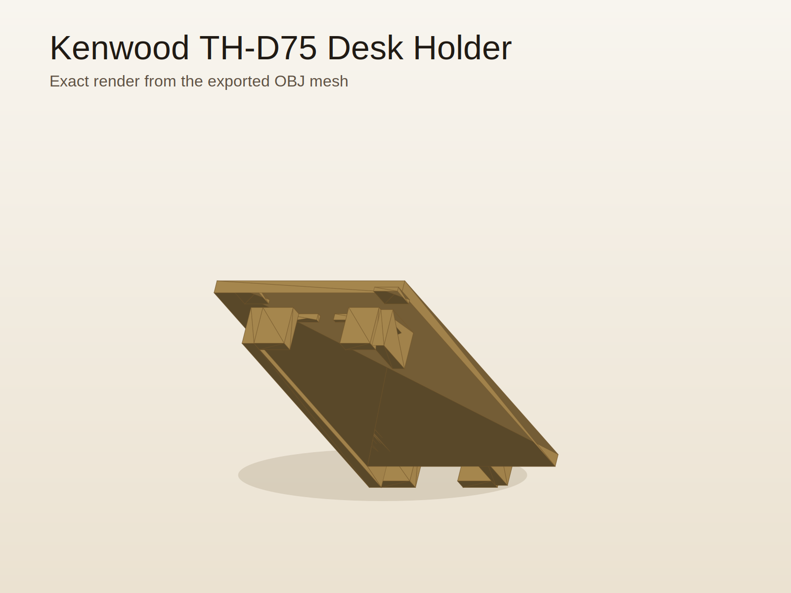
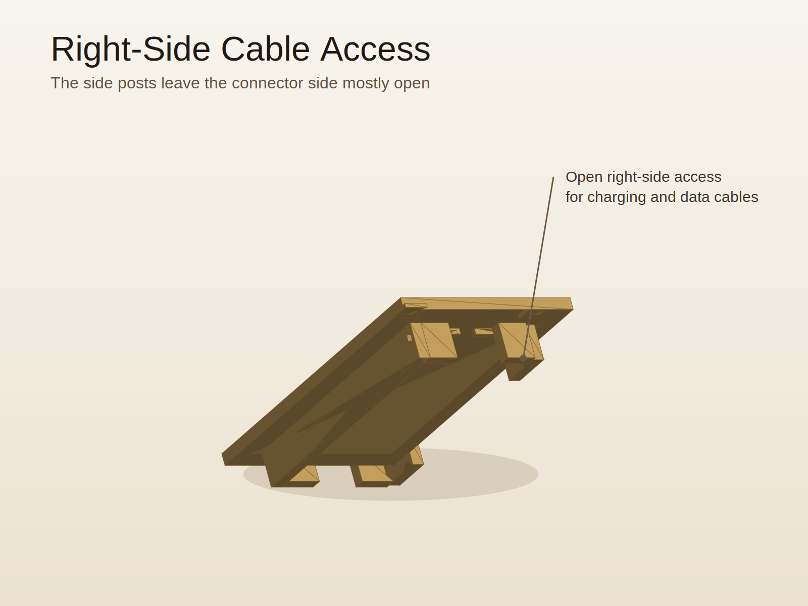
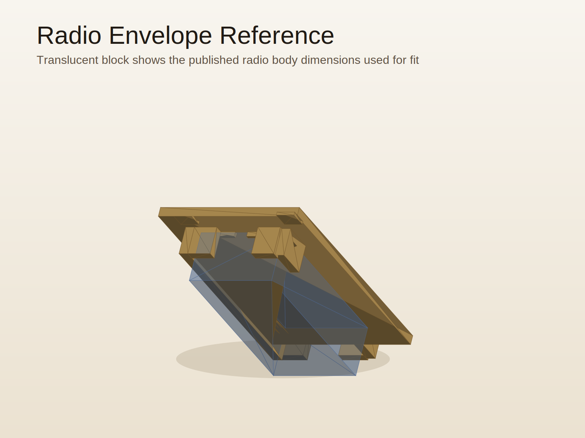
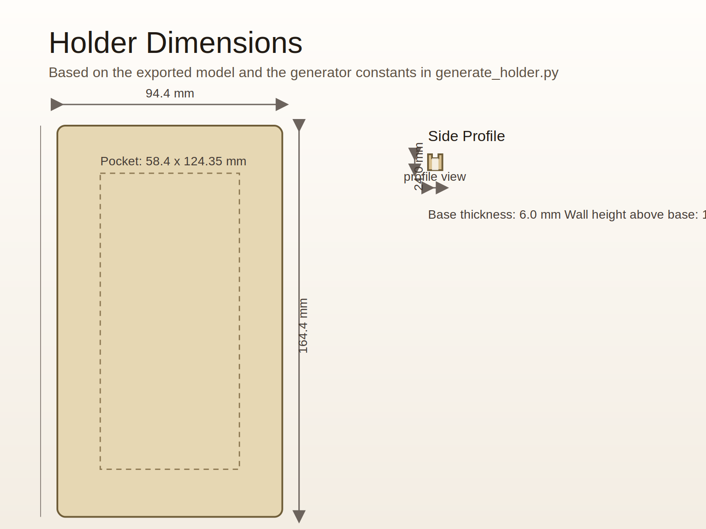

# Kenwood TH-D75 Desk Holder

A 3D-printable desktop cradle for the Kenwood TH-D75 handheld amateur radio.

## Preview Images

## Visual Summary

- One-piece cradle with a flat base that prints directly on the bed without supports.
- Full-length left wall plus short front and rear retaining sections keep the radio located while leaving the screen facing upward.
- Right side is intentionally open except for two short posts so cables can stay connected.
- Internal clearance is based on a 56.0 x 121.95 x 32.5 mm radio body with about 1.2 mm added per side.
- Approximate holder footprint is 94.4 x 164.4 mm and overall height is about 24.0 mm.

## Overview

This design is a print-ready one-piece holder intended to let the radio rest on
its back with the screen facing up while keeping the right-side ports
accessible.

## Design Goals

- Radio lies on its back with the screen facing up
- Right-side ports remain accessible
- Cables can stay plugged in on the right side
- Moderate fit with good incidental shock protection
- Antenna can stay attached
- Sized for a standard printer bed
- Beginner-friendly print with no supports

## Main Dimensions

- Published radio body size used: 56.0 x 121.95 x 32.5 mm
- Clearance added around body: about 1.2 mm per side
- Approximate holder footprint: 94.4 x 164.4 mm
- Approximate holder height: 24.0 mm

## Included Files

- `th-d75-desk-holder-v2.stl` - primary print file
- `th-d75-desk-holder-v2.3mf` - 3MF print file
- `th-d75-desk-holder-v2.obj` - mesh backup
- `generate_holder.py` - source used to regenerate the mesh
- `scripts/generate_preview_images.py` - regenerates the SVG preview images
- `print-settings.txt` - suggested slicer settings

## Print Notes

Print flat on the large bottom face.

- Supports: off
- Brim: optional, usually not needed
- Suggested material: PLA
- Suggested layer height: 0.20 mm

## Printing Tips

- Start with PLA unless you already know you want a higher-temperature material.
- If the first layer feels uneven or the corners want to lift, add a small brim.
- Three walls and about 20 percent infill are a good balance between stiffness and print time.
- If you want the holder to slide less on a desk, add thin rubber feet or adhesive felt to the underside after printing.

## Fit Notes

- The fit is based on the published TH-D75 body dimensions rather than a hand-measured sample.
- About 1.2 mm of clearance was added around the radio body, so printers that run slightly large or small may change the fit a bit.
- The design is intended to hold the radio on its back with the display facing up.
- The right side is left mostly open so charging or data cables can stay connected while the radio is in the holder.
- If you want a softer or slightly tighter fit, thin adhesive felt on the contact rails is an easy adjustment.

## License

MIT
